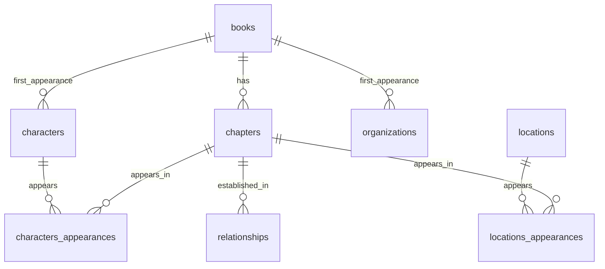

# Killing Eve Books Database

> **[Unofficial]** A comprehensive structured database & Knowledge Graph of the complete Killing Eve literary universe by Luke Jennings.

Covers all **5 published novels** plus the upcoming *Medusa*, with **170 characters**, **370 locations**, **51 organizations**, **303 relationships**, **512 glossary terms**, and chapter-level appearance tracking — all manually curated for accuracy.

---

> **⚠️ Spoiler Alert:** This dataset contains detailed information about characters, relationships, and plot events from all published Killing Eve books. If you haven't read the series yet, be aware that browsing the data **will reveal major spoilers**.

## Overview

This dataset captures the narrative universe of the *Killing Eve* book series in a fully relational format. Here are some directions it enables:

- **Network & graph analysis** — Import the `relationships` table into a graph tool (Gephi, NetworkX, Neo4j) to study character centrality, community detection, and how the network evolves across books
- **Narrative structure** — Analyze chapter-level character and location appearances to map pacing, POV shifts, and parallel storylines
- **Geographic analysis** — Plot locations on a map to visualize the geographic scope of each book, track character movements, and compare real vs. fictional places
- **Character evolution** — Track how character roles and relationships change across the series (e.g. allies becoming enemies)
- **NLP & information extraction** — Use the structured data as ground truth to benchmark entity extraction, relation extraction, or summarization models against the original texts
- **Fan reference** — A searchable encyclopedia of the entire book series

## Books Covered

| # | Title | Publisher | Date | Pages | Chapters |
| --- | --- | --- | --- | ---: | :---: |
| 1 | Codename Villanelle | Hodder & Stoughton | 2017-06-29 | 224 | 4 |
| 2 | No Tomorrow | Hodder & Stoughton | 2018-03-15 | 256 | 8 |
| 3 | Die For Me | Hodder & Stoughton | 2020-06-18 | 240 | 14 |
| 4 | Resurrection | Boldwood Books | 2024-10-31 | 256 | 46 |
| 5 | Long Shot | Boldwood Books | 2025-06-12 | 264 | 50 |
| 6 | Medusa | Boldwood Books | 2026-05-11 | — | — |

## Dataset Structure

```text
data/
├── books.csv                    # 6 books — title, author, publisher, dates
├── chapters.csv                 # 122 chapters — chapter number and title per book
├── characters.csv               # 170 characters — name, aliases, role, nationality, gender
├── characters_appearances.csv   # 883 entries — which character appears in which chapter
├── locations.csv                # 370 locations — hierarchical (continent → country → city → building)
├── locations_appearances.csv    # 581 entries — which location appears in which chapter
├── organizations.csv            # 51 organizations — criminal, intelligence, commercial
├── relationships.csv            # 303 knowledge-graph triples (subject → predicate → object)
└── glossary.csv                 # 512 terms — cultural references, slang, technical terms
```

### Entity-Relationship Diagram

The full ER diagram is available in Mermaid format at [`schema/er_diagram.mmd`](schema/er_diagram.mmd).



### Table Details

#### `books`

| Column | Type | Description |
| --- | --- | --- |
| `id` | INTEGER | Primary key |
| `title` | TEXT | Book title |
| `author` | TEXT | Author name |
| `publisher` | TEXT | Publisher |
| `publication_date` | TEXT | ISO 8601 date |
| `language` | TEXT | Language |
| `pages` | INTEGER | Page count |
| `chapters` | INTEGER | Chapter count |

#### `chapters`

| Column | Type | Description |
| --- | --- | --- |
| `id` | INTEGER | Primary key |
| `book_id` | INTEGER | FK → books |
| `chapter` | INTEGER | Chapter number within book |
| `name` | TEXT | Chapter title |

#### `characters`

| Column | Type | Description |
| --- | --- | --- |
| `id` | INTEGER | Primary key |
| `name` | TEXT | Common name |
| `full_name` | TEXT | Full name (if known) |
| `aliases` | TEXT | Known aliases |
| `description` | TEXT | Character description |
| `role` | TEXT | `protagonist` / `supporting` / `antagonist` / `minor` / `mentioned` |
| `nationality` | TEXT | Nationality |
| `gender` | TEXT | Gender |
| `first_appearance_book_id` | INTEGER | FK → books |

#### `locations`

| Column | Type | Description |
| --- | --- | --- |
| `id` | INTEGER | Primary key |
| `name` | TEXT | Location name |
| `location_type` | TEXT | `continent` / `country` / `region` / `city` / `building` / ... |
| `parent_location` | TEXT | Parent in the location hierarchy |
| `description` | TEXT | Description |
| `real_place` | BOOLEAN | `TRUE` = real, `FALSE` = fictional |

#### `organizations`

| Column | Type | Description |
| --- | --- | --- |
| `id` | INTEGER | Primary key |
| `name` | TEXT | Organization name |
| `aliases` | TEXT | Known aliases |
| `organization_type` | TEXT | `criminal` / `intelligence_agency` / `commercial` / ... |
| `description` | TEXT | Description |
| `first_appearance_book_id` | INTEGER | FK → books |

#### `relationships` (Knowledge Graph)

| Column | Type | Description |
| --- | --- | --- |
| `id` | INTEGER | Primary key |
| `book_id` | INTEGER | FK → books |
| `chapter_id` | INTEGER | FK → chapters |
| `subject_type` | TEXT | `character` / `organization` / `location` |
| `subject_id` | INTEGER | Subject entity ID |
| `subject_name` | TEXT | Subject name |
| `predicate` | TEXT | Relationship type (e.g. `works_for`, `child_of`) |
| `object_type` | TEXT | `character` / `organization` / `location` |
| `object_id` | INTEGER | Object entity ID |
| `object_name` | TEXT | Object name |

#### `glossary`

| Column | Type | Description |
| --- | --- | --- |
| `id` | INTEGER | Primary key |
| `term` | TEXT | Term |
| `category` | TEXT | Category (e.g. `cultural_reference`, `slang`, `technical_term`) |
| `description` | TEXT | Definition / explanation |

#### Junction Tables

- **`characters_appearances`** — (`book_id`, `chapter_id`, `character_id`)
- **`locations_appearances`** — (`book_id`, `chapter_id`, `location_id`)

## Project Structure

```text
killing-eve-books-database/
├── .github/
│   ├── workflows/
│   │   └── build-database.yml   # CI: auto-build SQLite on data changes
│   └── ISSUE_TEMPLATE/          # Templates for bug reports & proposals
├── data/                        # CSV dataset files
├── schema/
│   ├── schema.sql               # SQLite DDL (CREATE TABLE statements)
│   └── er_diagram.mmd           # Mermaid ER diagram
├── scripts/
│   └── export_to_gephi.py       # Export relationships to GEXF for Gephi
├── tests/
│   └── test_database_integrity.py  # DB integrity & data quality checks
├── database/                    # Generated SQLite database (gitignored)
├── main.py                      # CSV → SQLite import script
├── pyproject.toml               # Python project metadata
├── CHANGELOG.md                 # Version history
├── CITATION.cff                 # Citation metadata for academics
├── LICENSE-CODE                 # MIT (code)
├── LICENSE-DATA                 # CC BY 4.0 (dataset)
└── README.md
```

## Requirements

- **Python 3.10+** (no external dependencies — uses only the standard library)

It is recommended to use a virtual environment:

```bash
python -m venv .venv

# Linux / macOS
source .venv/bin/activate

# Windows
.venv\Scripts\activate
```

## Quick Start

### Option 1: Use the CSV files directly

The `data/` folder contains all tables as CSV files. Load them with any tool — Python, R, Excel, DuckDB, etc.

```python
import csv

with open("data/characters.csv", encoding="utf-8") as f:
    reader = csv.DictReader(f)
    for row in reader:
        print(row["name"], row["role"])
```

### Option 2: Download the pre-built database

A ready-to-use `killing_eve.db` file is available for download from the [**Releases**](../../releases/latest) page — no Python required.

### Option 3: Build a SQLite database from source

```bash
python main.py
```

This creates `database/killing_eve.db`. You can then query it:

```bash
sqlite3 database/killing_eve.db "SELECT name, role FROM characters WHERE role = 'protagonist';"
```

To specify a custom output path:

```bash
python main.py --db path/to/my_database.db
```

### Verify database integrity

```bash
python tests/test_database_integrity.py
```

### Export the knowledge graph for Gephi

```bash
python scripts/export_to_gephi.py
```

This generates `database/killing_eve_graph.gexf`, ready to open in [Gephi](https://gephi.org/).

### Option 4: Explore on Kaggle

The full dataset is available on Kaggle with an interactive Quickstart notebook:

📊 [**Dataset**](https://www.kaggle.com/datasets/skateddu/killing-eve-books-database)
📓 [**Quickstart Notebook**](https://www.kaggle.com/code/skateddu/quickstart-exploring-the-killing-eve-universe)

## Recommended Tools

Here are some tools to explore and visualize the data:

| Tool | Use case | Link |
| --- | --- | --- |
| **DB Browser for SQLite** | Browse tables, run queries, inspect the full database visually | [sqlitebrowser.org](https://sqlitebrowser.org/) |
| **Gephi** | Visualize and analyze the knowledge graph as a network — run `python scripts/export_to_gephi.py` to generate a ready-to-use GEXF file | [gephi.org](https://gephi.org/) |
| **DuckDB** | Query CSV files directly with SQL, no database build needed | [duckdb.org](https://duckdb.org/) |
| **Datasette** | Instantly publish the SQLite database as an explorable web interface | [datasette.io](https://datasette.io/) |
| **Kepler.gl** | Map-based visualization of locations data | [kepler.gl](https://kepler.gl/) |

## Known Limitations

- **`relationships` table** — Currently covers only books 1–3 (*Codename Villanelle*, *No Tomorrow*, *Die For Me*). Relationships for books 4–5 are in progress and will be added in future updates.

## Data Generation

This dataset was built through a multi-stage pipeline combining text processing, semantic chunking, agentic AI extraction, and manual curation.

### Pipeline overview

```text
Books (raw text)
  │
  ├─ 1. Chapter splitting (regex-based, per-book separator analysis)
  │
  ├─ 2. Semantic chunking (Chonkie — SemanticChunker)
  │     └─ Long chapters split into narratively coherent segments
  │
  ├─ 3. Agentic entity & relationship extraction (Agno + SQL tool)
  │     ├─ Agent reads each chunk with full schema awareness
  │     ├─ Identifies entities (characters, locations, organizations)
  │     ├─ Extracts relationships as knowledge-graph triples
  │     └─ Populates a PostgreSQL database (Docker + volume)
  │
  ├─ 4. Manual curation & semantic cleanup (Claude Code)
  │     └─ Reviewed and refined for consistency, deduplication, and accuracy
  │
  └─ 5. Export to CSV → SQLite
```

### Tools & models used

| Stage | Tool | Role |
| --- | --- | --- |
| Chapter splitting | Python `re` | Regex-based splitting after analyzing per-book chapter separators |
| Semantic chunking | [**Chonkie**](https://github.com/chonkie-inc/chonkie) | `SemanticChunker` to segment long chapters into narratively coherent pieces |
| AI agent framework | [**Agno**](https://github.com/agno-agi/agno) | Orchestrates the extraction agent with a SQL tool and schema context |
| Extraction model | [**Gemini 3 Flash Preview**](https://openrouter.ai/google/gemini-3-flash-preview) via [OpenRouter](https://openrouter.ai/) | Entity recognition and relationship extraction |
| Staging database | [**PostgreSQL**](https://www.postgresql.org/) (Docker) | Intermediate structured storage during extraction |
| Manual curation | [**Claude Code**](https://docs.anthropic.com/en/docs/claude-code) | Semantic cleanup, deduplication, consistency checks, and refinement |

### Why this approach?

- **Semantic chunking** ensures the AI agent processes narratively meaningful segments rather than arbitrary fixed-size windows, improving extraction quality
- **Agentic SQL extraction** allows the model to directly populate a relational schema, enforcing structural consistency from the start
- **Human-in-the-loop curation** catches hallucinations, resolves ambiguities, and ensures the final dataset faithfully represents the source material

## License

This project uses a **dual-license** model:

| Component | License | File |
| --- | --- | --- |
| **Dataset** (CSV files, schema, ER diagram) | [CC BY 4.0](https://creativecommons.org/licenses/by/4.0/) | [LICENSE-DATA](LICENSE-DATA) |
| **Code** (Python scripts, tests, CI workflow) | [MIT](https://opensource.org/licenses/MIT) | [LICENSE-CODE](LICENSE-CODE) |

The CC BY 4.0 license applies to the **structure, compilation, and organization** of the database — not to the underlying narrative content of the *Killing Eve* novels, which remains the intellectual property of Luke Jennings and his publishers.

> **Disclaimer:** This is an unofficial fan-made dataset. *Killing Eve* and all related characters, names, and storylines are the intellectual property of Luke Jennings and their respective publishers ([Hodder & Stoughton](https://www.hodder.co.uk/), [Boldwood Books](https://www.boldwoodbooks.com/)). The character descriptions and relationship data included in this dataset are provided under the principles of fair use / fair dealing, strictly for research, analysis, and educational purposes. If you are a rights holder and have concerns, please [open an issue](../../issues).

## Acknowledgments

This project exists thanks to the brilliant work of **Luke Jennings**, whose *Killing Eve* novels created a rich and compelling universe that made this dataset possible. All original characters, storylines, and narrative elements are his creation. Copyright for the original books belongs to Luke Jennings and his publishers ([Hodder & Stoughton](https://www.hodder.co.uk/), [Boldwood Books](https://www.boldwoodbooks.com/)).

## Contributing

Contributions are welcome! If you find inaccuracies or want to add data (e.g. for *Medusa* when released), please open an issue or submit a pull request.

I'm also happy to hear **proposals and ideas** — whether it's corrections to the data, suggestions for new tables or fields, or entirely new directions for the project (analysis scripts, visualizations, integrations, etc.). Feel free to open an issue to start a discussion.

### For non-technical contributors

The full dataset is available as a **read-only Google Drive folder** where you can view the tables data and suggest corrections or additions via comments:

📂 [**Open Google Drive folder**](https://drive.google.com/drive/folders/1J9EwqRHUvA4vYyKWvkzntSij1pa0PQ4o?usp=sharing)
